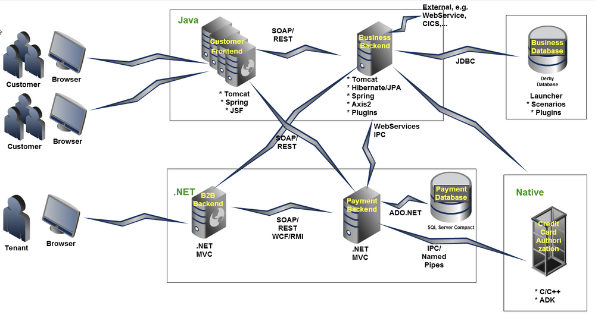
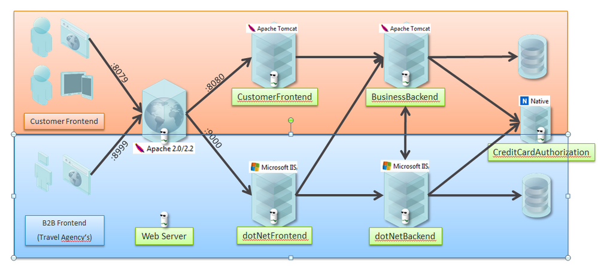
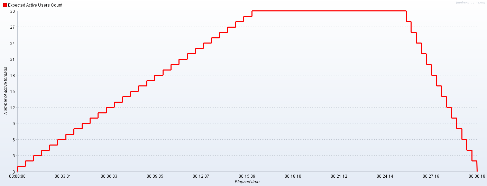

# Plano de Teste de Performance Baseline - Easy Travel 

## 1. Introdução
O objetivo deste documento é delinear o plano para a realização de testes de desempenho para o aplicativo EasyTravel. Este documento fornecerá uma visão geral dos seguintes componentes:
- Sumário Executivo;
- Arquitetura da Aplicação;
- Planejamento do Teste de Performance;
- Execução do Teste de Performance;

## 2. Sumário Executivo
O Easy Travel é uma plataforma de viagem que oferece aos usuários um portal web intuitivo e acessível. Através deste portal, os usuários podem explorar uma variedade de opções de viagens e efetuar suas compras de forma conveniente, utilizando cartão de crédito.

Tom, o responsável pelo lançamento da aplicação, está revisando os últimos detalhes antes de disponibilizar a plataforma para o público. Ele compreende que o sucesso do EasyTravel não só depende da sua funcionalidade, mas também da sua capacidade de lidar com uma alta demanda de usuários.

Diante desse cenário, Tom e sua equipe planejam realizar uma certificação técnica para medir até quantos usuários simultâneos a aplicação consegue suportar em dois cenários distintos: um utilizando uma instância t2.medium e outro t2.large no provedor de nuvem AWS.

## 3. Arquitetura da Aplicação
A arquitetura geral consiste em:

- Dois processos Java que fornecem o Frontend do Cliente e o servidor backend de negócios
- Dois processos .NET que fornecem o Frontend B2B e o servidor backend de pagamento
- Um aplicativo C++ que recebe números de cartão de crédito via IPC/Named Pipe e simula a verificação do número com um provedor terceirizado.
- Uma GUI de lançamento que permite controlar os processos e também hospeda o Banco de Dados - Java Derby (a menos que outro banco de dados JDBC esteja configurado)
- Um Banco de Dados Java Derby para armazenar os dados de viagem (pode ser facilmente substituído por outros bancos de dados JDBC)
- Um Banco de Dados MS SQL Server Compact Edition para armazenar dados de pagamento
- Opcionalmente, uma instância do Apache Web Server para balanceamento de carga

  

  

## 4. Planejamento do Teste de Performance

### 4.1 Metodologia

A metodologia de teste de Performance será a de baseline, que consiste em estabelecer um ponto de referência inicial para o desempenho do sistema, aplicação ou componente antes de qualquer alteração significativa. Isso ajuda a entender o estado atual do desempenho e fornece uma base para comparação após a implementação de mudanças, atualizações ou otimizações.

### 4.2 Escopo

| Passo # | Ação                                              |
|---------|---------------------------------------------------|
| 1.      | Página Inicial                                    |
| 2.      | Criação de Usuário                                |
| 3.      | Login e autenticação do usuário.                  |
| 4.      | Reserva de viagens recomendadas.                  |
| 5.      | Processamento de pagamento com cartão de crédito. |

### 4.3 Cenários de Teste
Os seguintes cenários de teste serão executados durante os testes de desempenho:

| Cenário | Usuários Simultâneos (VUs) | Duração | Ambiente |
|---------|----------------------------|---------|----------|
| 1.      | 30 VUs                     | 30 min  | 01       |
| 2.      | 30 VUs                     | 30 min  | 02       |

### 4.4 Ambiente de Teste
Os testes de desempenho serão realizados em ambientes com a seguintes configurações:

| Ambiente         | Tipo                 | CPU     | Memória RAM | Armazenamento |
|------------------|----------------------|---------|-------------|---------------|
| Ambiente 01      | Amazon EC2 T2.Medium | 2 vCPUs | 4 GiB       | 20GB          |
| Ambiente 02      | Amazon EC2 T2.Large  | 2 vCPUs | 8 GiB       | 20GB          |
| Máquina Injetora | Amazon EC2 T2.Medium | 2 vCPUs | 4 GiB       | 20GB          |

### 4.5 Rampa de Usuários Simultâneos (VUs)
Durante os testes, será implementada uma rampa gradual de usuários para simular um aumento progressivo na carga. A configuração da rampa de usuários será a seguinte:

- O teste iniciará com 1 usuário e, a cada 22 segundos, um novo usuário será adicionado.
- O número total de usuários será alcançado em 30 minutos.
- A carga será mantida constante em 30 usuários por um período de 10 minutos.
- Após esse período, as threads serão gradualmente encerradas a cada 20 segundos.
- O teste terá uma duração total de 30 minutos.

  

### 4.6 Massa de Dados
A massa de dados será provisionada através de um script Python chamado *data_generator.py* para geração de arquivo csv com os seguintes dados:

- primeiro_nome
- sobrenome
- email
- senha
- estado
- rua
- número
- telefone
- cartão_de_crédito

## 5.0 Métricas Avaliadas
As seguintes métricas de desempenho serão medidas durante os testes:

| Métrica                    | Descrição                                                                                                      |
|----------------------------|----------------------------------------------------------------------------------------------------------------|
| Tempo de resposta          | O tempo necessário para o aplicativo responder às solicitações do usuário. Serão medidos os percentis 90 e 95. |
| Taxa de transferência      | O número de solicitações processadas por unidade de tempo.                                                     |
| Taxa de erro               | A porcentagem de solicitações falhadas.                                                                        |
| Latência de Rede           | Tempo necessário para enviar dados de um ponto a outro na rede.                                                |
| Largura de Banda           | Capacidade máxima de transferência de dados da rede em um determinado período de tempo.                        |
| Disponibilidade do Serviço | Porcentagem de tempo que o serviço está disponível e funcionando corretamente.                                 |

Métricas de Infraestrutura:

| Métrica                    | Descrição                                                                               |
|----------------------------|-----------------------------------------------------------------------------------------|
| CPU Utilization            | Utilização da CPU, indicando a porcentagem de capacidade de processamento utilizada.    |
| Memória Disponível         | Quantidade de memória RAM disponível no sistema.                                        |
| Utilização de Disco        | Utilização do armazenamento em disco, indicando a porcentagem de capacidade utilizada.  |
| Latência de Rede           | Tempo necessário para enviar dados de um ponto a outro na rede.                         |
| Largura de Banda           | Capacidade máxima de transferência de dados da rede em um determinado período de tempo. |
| Disponibilidade do Serviço | Porcentagem de tempo que o serviço está disponível e funcionando corretamente.          |